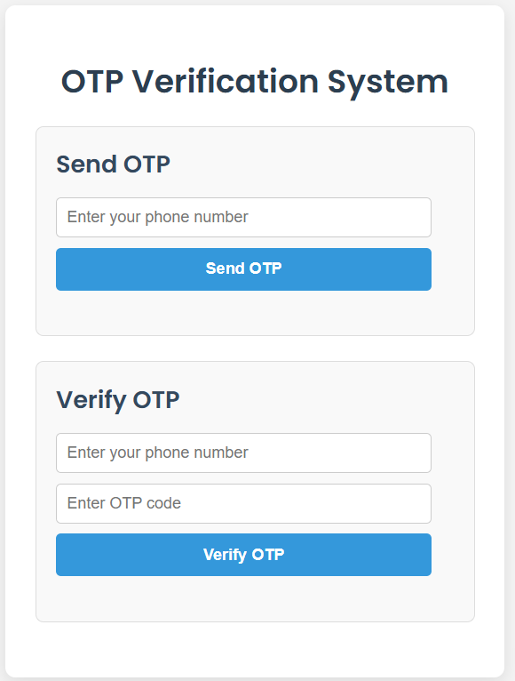

# 🔐 Redis-based OTP Verification System (Dockerized)

This is a beginner-friendly, production-ready **OTP (One-Time Password) verification system**, built using **Python (Flask)**, **Redis**, and **Docker**. It allows users to generate and verify OTPs with a simple web interface and is fully containerized for easy deployment.



---

## 🎯 Project Objective

The main goals of this project are:

* ✅ Generate a 6-digit OTP based on a phone number and store it in Redis with a time limit.
* ✅ Ensure the OTP automatically expires after 5 minutes.
* ✅ Allow users to verify the OTP and delete it from Redis after successful verification.
* ✅ Run the entire system using **Docker Compose** for portability and simplicity.
* ✅ Provide a basic web interface using HTML/CSS/JS for user interaction.

---

## 📁 Project Structure

```
my-otp-project/
├── frontend/
│   ├── index.html          # Main HTML UI page
│   ├── style.css           # CSS for styling the page
│   └── script.js           # JavaScript for calling API endpoints
├── app.py                  # Flask app for generating/verifying OTPs
├── requirements.txt        # Python package dependencies
├── Dockerfile              # Docker instructions for the Flask app
└── docker-compose.yml      # Compose file to run Redis and Flask together
```

---

## ⚙️ Explanation of Each File

### `app.py` – Flask Backend

* **`/generate-otp`**: Generates a random 6-digit OTP based on the phone number, saves it to Redis, and sets a 5-minute expiration.
* **`/verify-otp`**: Compares user-submitted OTP with the one stored in Redis. If matched, deletes the key and confirms verification.

> Also serves frontend files – so visiting `localhost:5000` loads the UI directly.

---

### `frontend/` – UI Files

* `index.html` – The web page layout
* `style.css` – Styling and basic responsive design
* `script.js` – JavaScript code that uses `fetch()` to call the backend API routes for sending and verifying OTPs

---

### `Dockerfile`

Defines how to build a Docker image for the Flask app:

1. Use **Python 3.9** as the base image
2. Copy `requirements.txt`
3. Install Python dependencies with `pip`
4. Copy the rest of the app files
5. Expose **port 5000**
6. Run `python app.py` on container start

---

### `docker-compose.yml`

This file launches the system with two containers:

* **redis** – Runs Redis as a container on port 6379
* **app** – Runs your Flask backend, which depends on Redis

Port `5000` of the host is mapped to the Flask app.

---

## 🚀 How to Run the Project

In your terminal, run:

```bash
docker-compose up --build
```

Then visit the site in your browser:

```
http://localhost:5000
```

---

## 📦 How Others Can Clone and Run from GitHub

1. Open Terminal or Git Bash
2. Clone the repository and move into the directory:

```bash
git clone https://github.com/your-username/my-otp-project.git
cd my-otp-project
docker-compose up --build
```

> Replace `your-username` with your actual GitHub username.

---

## 💡 Future Improvements (Ideas)

* [ ] Add rate limiting for OTP generation per number
* [ ] Integrate SMS Gateway (e.g., Twilio) to send real OTPs
* [ ] Add email-based verification
* [ ] Improve UI with TailwindCSS or Bootstrap
* [ ] Add an admin dashboard to monitor OTP status (optional)

---

## 🧰 Tech Stack Summary

| Tool            | Description                      |
| --------------- | -------------------------------- |
| **Flask**       | Python-based web framework       |
| **Redis**       | In-memory database to store OTPs |
| **Docker**      | Containerization platform        |
| **HTML/CSS/JS** | Frontend development for UI      |

---

## 🙌 Contributions Welcome

This is an open-source project. Feel free to:

* Fork it and enhance it
* Use it as a boilerplate
* Report issues or request features
* Deploy it for your own mini project

---
